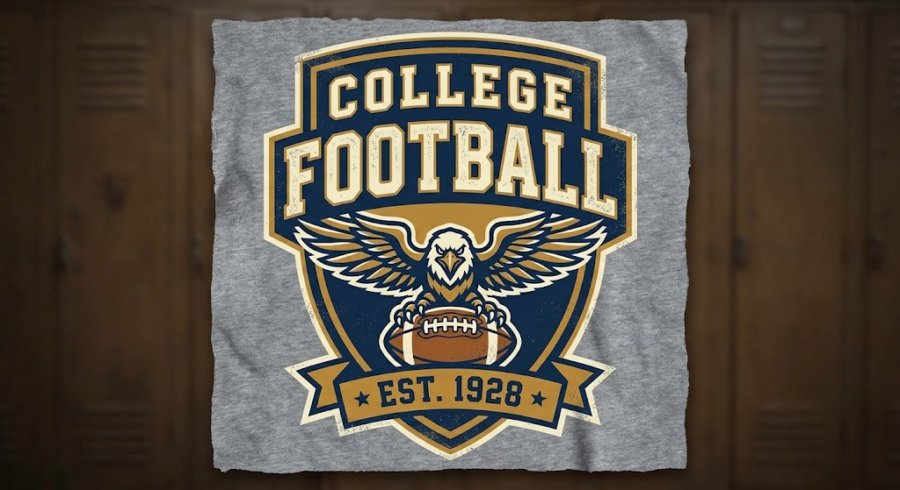
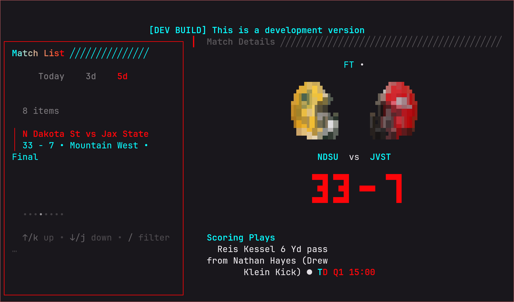

<div align="center">
  
  <h1>Golazo (CFB fork)</h1>
</div>

<div align="center">

[](https://github.com/jaslrobinson/golazo)
[](https://opensource.org/licenses/MIT)
[](https://goreportcard.com/report/github.com/jaslrobinson/golazo)
[](https://github.com/jaslrobinson/golazo/actions/workflows/build.yml)


A minimalist terminal user interface (TUI) for following **NCAA college football** in real-time. Live scores, conferences, matchup details, win-probability, player leaders, rankings polls, and curated team helmet art, directly in your terminal.

*Perfect for developers and terminal enthusiasts who want game updates without leaving their workflow.*
</div>

> [!NOTE]
> This is a fork of [**@0xjuanma/golazo**](https://github.com/0xjuanma/golazo) — a TUI for following **soccer** matches — modified to follow American college football instead, via ESPN's data. All credit for the original app, its architecture, and the JSON CLI/agent-mode design goes to [**@0xjuanma**](https://github.com/0xjuanma). See [What changed from upstream](#what-changed-from-upstream) below for exactly what's different in this fork.

<div align="center">
  
</div>

<div align="center">

**Quick Install:** `go install github.com/jaslrobinson/golazo@latest` · [Other options](#installation--update)

</div>

## Features

- **Live & Finished Games**: Real-time score updates, plus results from today, last 3 days, or last 5 days
- **Conferences**: Browse by FBS conference (SEC, Big Ten, ACC, Big 12, American Athletic, Conference USA, MAC, Mountain West, Sun Belt, FBS Independents)
- **Matchup Details**: Scoring plays, down/distance/field-position situation, categorized player leaders, win-probability momentum, and AP/Coaches rankings polls in focused dialogs
- **Curated Helmet Art**: Real team helmets rendered as colored terminal art (33 programs curated so far) for both teams in a matchup
- **Desktop Notifications**: Touchdown/field goal/safety alerts as they happen
- **JSON CLI for agents**: `golazo live`, `finished`, `match`, `leagues`, `capabilities` — inherited unmodified from upstream, so it still returns **soccer** match data, not college football. See [docs/CLI.md](docs/CLI.md).

## What changed from upstream

- The interactive app's main menu now shows **Finished Games**, **Live Games**, and **Conferences** — all backed by ESPN's college-football data. Upstream's World Cup mode and league Settings menu are no longer reachable from the menu (the code is still there, just unwired) — see `internal/constants/strings.go`.
- New match-detail dialogs: Situation (`f`), Leaders, Momentum, and Rankings, plus a Standings dialog (`s`) — none of these have a soccer equivalent in upstream.
- New `internal/ui/helmet` package renders curated team helmets as colored terminal art (Unicode sextant-block technique) for both teams in a matchup, mirrored to face each other.
- New `internal/espncfb` package implements ESPN's college-football site API against the same `api.Client` interface upstream built for FotMob (soccer), so the rest of the app didn't need a rewrite to add a second sport.
- The **JSON CLI is untouched** and still talks to FotMob (soccer) — it hasn't been ported to the CFB data source yet.

## Installation & Update

**Self-update:** Run `golazo --update` anytime to get the latest version (requires a release published on this fork — see note below).

### Go install

```bash
go install github.com/jaslrobinson/golazo@latest
```

Works with zero extra setup since this fork doesn't have its own Homebrew tap or GitHub releases yet.

### Install script

**macOS / Linux:**
```bash
curl -fsSL https://raw.githubusercontent.com/jaslrobinson/golazo/main/scripts/install.sh | bash
```

**Windows (PowerShell):**
```powershell
irm https://raw.githubusercontent.com/jaslrobinson/golazo/main/scripts/install.ps1 | iex
```

> [!NOTE]
> These scripts download a prebuilt binary from this fork's GitHub Releases. Until a `v*.*.*` tag is pushed here, there are no releases yet — use `go install` or build from source instead.

### Build from source

```bash
git clone https://github.com/jaslrobinson/golazo.git
cd golazo
go build
./golazo
```

## Usage

Run the application:
```bash
golazo
```

**Navigation:** `↑`/`↓` or `j`/`k` to move, `Enter` to select, `/` to filter, `Tab` to focus view, `Esc` to go back, `q` to quit.

## CLI / Agent Mode

For scripts and agentic tools (Claude Code, Codex, MCP servers), Golazo exposes JSON subcommands. **These are inherited unmodified from upstream and return soccer match data**, not college football:

```bash
golazo capabilities | jq .                       # self-discover the contract
golazo live                                       # live matches right now
golazo finished --include-upcoming                # today's full slate
golazo finished --days 3                          # last 3 days
golazo match 2001 --mock                          # full match details (best-effort against real IDs; reliable with --mock)
golazo leagues --all                              # every supported league
```

Full contract — JSON envelope, error codes, exit codes, retry policy, schema, jq recipes — in **[docs/CLI.md](docs/CLI.md)**.

## Docs

- [Supported Leagues](docs/SUPPORTED_LEAGUES.md): Soccer leagues covered by the JSON CLI (not this fork's college-football conferences, which are hardcoded in `internal/espncfb/conferences.go`)
- [Notifications](docs/NOTIFICATIONS.md): Desktop notification setup and configuration
- [CLI / Agent Mode](docs/CLI.md): JSON subcommands for agents and scripts (`golazo live`, `finished`, `match`, `leagues`)

---

<div align="center">

**Built with** [Bubble Tea](https://github.com/charmbracelet/bubbletea), [Lip Gloss](https://github.com/charmbracelet/lipgloss) & [Bubbles](https://github.com/charmbracelet/bubbles) by [Charm](https://charm.sh)

Original author: [@0xjuanma](https://github.com/0xjuanma) · CFB fork: [@jaslrobinson](https://github.com/jaslrobinson)

</div>
